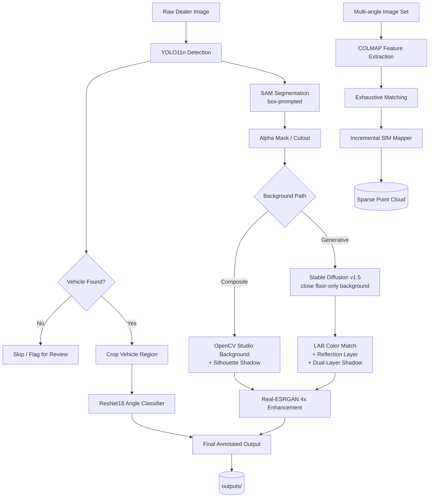
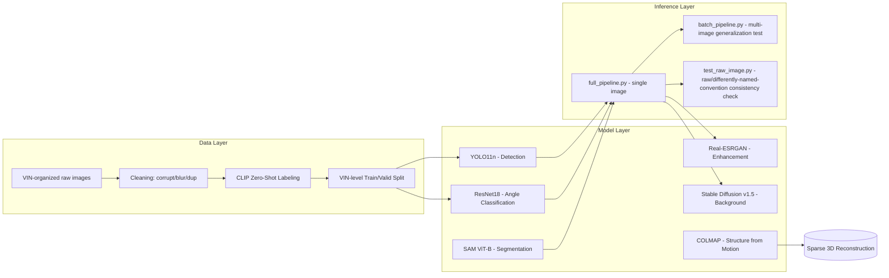

# Spyne AI Clone — Automotive Computer Vision Pipeline

A CPU-only, end-to-end computer vision pipeline for automotive image processing — detection, angle classification, segmentation, background removal/generation, GAN-based enhancement, and structure-from-motion — built to mirror Spyne's production image pipeline, trained on a self-collected, VIN-organized dealership dataset.


---

## Executive Summary

Online vehicle marketplaces and dealership websites live or die on photo quality. A dealer photographs a car in a lot, in front of a showroom wall, or under mixed lighting, with a phone or a basic DSLR. The raw image usually has a cluttered background, dealer watermarks baked in, and inconsistent framing across listings. Manually cropping, retouching, and re-backgrounding thousands of these images a day does not scale — this is the exact problem Spyne's automotive imaging pipeline solves commercially: turn a raw dealer photo into a studio-quality, consistently-framed listing image automatically.

This repository is a from-scratch reconstruction of that pipeline's core stages, built as a technical portfolio project for an internal transfer interview onto Spyne's AI/tech team. It's not a research paper — it's a production-style demo, built entirely CPU-only on a Windows laptop with no GPU anywhere in the pipeline. Every model choice below was made with "what actually runs on real hardware" in mind, not "what gets the best benchmark number." Where that tradeoff mattered, it's called out explicitly.

It's built the way the production system is described to work: detect the vehicle, understand which angle it was shot from, cut it out pixel-precisely, replace the background, sharpen the result, and (as a research extension) reconstruct the car in 3D from multiple angles. Every stage was implemented and evaluated on real, messy, dealer-style photos — not a clean academic benchmark — because that mismatch between clean training data and messy production data is itself one of the more interesting engineering problems in this space.

---

## Demo

> Images referenced below live in `outputs/` and render automatically once this README and that folder are committed together.

| Stage | Output | File |
|---|---|---|
| Raw input | Watermarked dealer photo | source image in `datasets/vehicle_dataset/valid/images/` |
| Detection | Bounding box, confidence 0.978 | `outputs/pipeline_result.jpg` |
| Angle classification | "front", 87.94% confidence | `outputs/pipeline_result.jpg` (label overlay) |
| Segmentation | Green mask overlay, confidence 0.996 | `outputs/pipeline_result.jpg` |
| Background removal | Transparent PNG cutout | `outputs/pipeline_cutout.png` |
| Background generation (composite) | Studio backdrop + shadow | `outputs/final_studio_image.jpg` |
| Background generation (diffusion) | SD v1.5 generated floor/showroom | `outputs/diffusion_final.jpg` |
| Enhancement | 4x super-resolution (1080×1440 → 4320×5760) | `outputs/gan_enhanced.png` |
| Batch generalization test | 6 random unseen vehicles | `outputs/batch_results/result_*.jpg` |
| Raw image consistency check | Differently-named-convention VIN, full pipeline re-run | `outputs/raw_test_result.jpg`, `outputs/raw_test_studio.jpg` |
| SfM | Sparse point cloud (partial, 6/9 images registered, ~230 points) | `datasets/sfm_output/sparse/0/` |

---

## Input → Output Showcase

```
Raw Dealership Image  (watermarked, cluttered background)
        │
        ▼
Vehicle Detection            → YOLO11n, bounding box + confidence
        │
        ▼
Vehicle Crop                 → crop region fed to classifier
        │
        ▼
Angle Prediction              → ResNet18 → front / side / rear
        │
        ▼
Segmentation                  → SAM (box-prompted), pixel mask
        │
        ▼
Background Removal            → alpha channel from SAM mask
        │
        ▼
Background Generation          → OpenCV composite  OR  Stable Diffusion v1.5
        │
        ▼
Lighting Match + Reflection + Shadow  → LAB color match, faded reflection, dual-layer shadow
        │
        ▼
Real-ESRGAN Enhancement        → 4x super-resolution
        │
        ▼
Final Studio Image
        │
        ▼
(Research extension) 3D Reconstruction → COLMAP sparse point cloud
```

---

## Complete Pipeline (Mermaid)



## System Architecture (Mermaid)



---

## Repository Structure

This tree reflects the actual project layout (verified against the local file explorer, not just described from memory) — a few items called for a decision on whether they belong in version control at all; see the note below.

```
spyne-ai-clone/
├── app/                            # scaffolded application layer for eventual API wrapping
│   ├── api/
│   ├── models/
│   ├── services/
│   ├── utils/
│   └── main.py
├── colmap-x64-windows-nocuda/      # bundled COLMAP Windows binary (see note below — likely .gitignore, not commit)
├── datasets/
│   ├── vehicle_dataset/            # detection dataset (train/valid, images + YOLO labels)
│   ├── sorted_by_clip/             # CLIP pass 1 output: exterior / interior / misc
│   ├── angle_dataset_v2/           # CLIP pass 2 output: front / side / rear
│   ├── angle_dataset_split/        # VIN-level train/valid split of angle_dataset_v2
│   ├── angle_dataset_final/        # TODO: confirm exact purpose (final cleaned/merged angle set used for training?)
│   ├── sfm_images/                 # TODO: confirm — likely the initial candidate image pool before exterior-only filtering
│   ├── sfm_images_v2/              # 9-image exterior-only subset actually used for SfM
│   └── sfm_output/                 # COLMAP database + sparse reconstruction
├── docs/
│   └── screenshots/                # dev-process screenshots (editor state, SfM output, etc.)
├── models/
│   ├── angle_classifier.pt         # trained ResNet18 weights
│   ├── sam_vit_b_01ec64.pth        # SAM checkpoint (pretrained, not retrained)
│   ├── RealESRGAN_x4plus.pth       # Real-ESRGAN checkpoint (pretrained)
│   └── train_classifier.py         # ResNet18 training script (lives here, not in outputs/)
├── runs/detect/vehicle_detection_v2/weights/best.pt   # trained YOLO11n weights
├── outputs/                        # pipeline scripts + generated result images
│   ├── vin_based_split.py
│   ├── auto_label.py
│   ├── train_model.py
│   ├── auto_label_angles.py
│   ├── clip_angle_classify_v2.py
│   ├── split_angle_dataset.py
│   ├── find_best_vin_for_sfm.py    # selects the VIN with the most images as SfM candidate
│   ├── prepare_sfm_images.py       # filters that VIN down to the 9-image exterior-only subset
│   ├── full_pipeline.py
│   ├── batch_pipeline.py
│   ├── add_background.py
│   ├── diffusion_bg.py
│   ├── gan_enhance.py
│   ├── test_raw_image.py           # NEW — runs detection+angle+segmentation on a raw, differently-named-convention image
│   ├── raw_test_diffusion.py       # NEW — diffusion background generation for the raw-image consistency check
│   ├── raw_test_enhance.py         # NEW — Real-ESRGAN enhancement for the raw-image consistency check
│   ├── batch_results/              # per-image outputs from batch_pipeline.py
│   ├── pipeline_result.jpg / pipeline_cutout.png / final_studio_image.jpg / diffusion_final.jpg / diffusion_background.png / gan_enhanced.png   # main demo outputs
│   ├── test_result.jpg             # general pipeline test output
│   ├── raw_test_result.jpg         # NEW — annotated detection/angle/segmentation output for the raw-image test
│   ├── raw_test_studio.jpg         # NEW — composite-background output for the raw-image test
│   ├── raw_diffusion_cutout.png    # NEW — SAM cutout used as diffusion-compositing input for the raw-image test
│   ├── raw_diffusion_background.png # NEW — SD v1.5 generated floor background for the raw-image test
│   ├── raw_test_diffusion_final.jpg # NEW — final diffusion composite for the raw-image test
│   └── raw_test_enhanced.png       # NEW — Real-ESRGAN 4x enhanced output for the raw-image test
├── notebooks/
├── tests/
├── uploads/                        # runtime/scratch folder for uploaded test images (likely .gitignore)
├── data.yaml
├── requirements.txt
├── yolo11n.pt                      # base pretrained checkpoint (Ultralytics auto-download)
├── yolov8n.pt                      # base pretrained checkpoint, used for auto-labeling
└── README.md
```

> **Repository hygiene note:** `colmap-x64-windows-nocuda/`, `venv/`, `uploads/`, and the loose `yolo11n.pt` / `yolov8n.pt` / `*.pth` checkpoint files are all things you'd typically keep out of git — either via `.gitignore` (binaries, venv, scratch uploads) or [Git LFS](https://git-lfs.github.com/) (large model checkpoints, if they do need to be versioned). Committing a full COLMAP binary distribution and multiple hundred-MB+ checkpoint files directly will bloat the repo significantly. Document the download/setup steps in [Getting Started](#setup) instead, which this README already mostly does for the Python packages.

---

## Setup

Python 3.11.

```bash
pip install ultralytics segment-anything transformers torch torchvision opencv-python pillow realesrgan basicsr diffusers accelerate
```

Runs fully on CPU. No GPU required anywhere in this pipeline — that constraint shaped almost every model choice in this project (nano YOLO, ResNet18 over deeper variants, SAM zero-shot instead of training a segmenter, and eventually full Stable Diffusion over the faster turbo variant once stability mattered more than speed).

**COLMAP** is used via its Windows CLI binary rather than a pip package — see the [COLMAP releases page](https://github.com/colmap/colmap/releases) for the no-CUDA Windows build if you don't already have `colmap-x64-windows-nocuda/` locally.

---

## Dataset

**Source:** 176 unique vehicles, each in its own VIN-named folder, collected from real dealership listings — 5356 raw images total (exterior, interior, and miscellaneous close-up shots mixed together, with inconsistent per-VIN naming conventions).

**Cleaning pipeline:**
| Check | Method | Result |
|---|---|---|
| Corrupt files | `cv2.imread` returns `None` | 0 found |
| Blur | Laplacian variance, threshold 100.0 | 35 found, kept (negligible) |
| Duplicates | MD5 hash of file bytes | 37 removed (35 duplicate groups) |

**Label generation — why CLIP, not filenames:**
Filenames appeared to encode an angle sequence (`VIN_1_1_Exterior`, `VIN_1_2_Exterior`, … `VIN_1_8_Exterior`), which looked like a free ground-truth label — position 1 always the same angle, position 2 always the next, and so on. This was checked before being trusted: sampled the same "position number" across multiple VINs and compared visually. Position 1 was reliably consistent across VINs; positions 2–8 were not (side/front/rear showed up at the same position number for different vehicles). The data had clearly been collected/uploaded by different photographers or processes without a shared angle-sequencing convention. Filenames couldn't be trusted as labels, so CLIP (`openai/clip-vit-base-patch32`) was used for zero-shot labeling in two passes instead:

- **Pass 1** — `exterior` / `interior` / `misc` → 2562 / 2374 / 420 images.
- **Pass 2** (on the 2562 exterior images) — `front` / `side` / `rear` → 1528 / 254 / 780 images. An initial 5-class attempt (adding `front_angle` and `rear_angle`) produced only 10 images in `rear_angle` — the two prompts were semantically too close for CLIP to reliably separate — so the label set was simplified to 3 balanced classes.

**Data leakage prevention:** All train/valid splits (both the detection dataset and the angle-classification dataset) were done at the **VIN level**, not the image level — every image belonging to a given VIN is assigned entirely to either train or valid, never split across both. A random image-level split would let near-duplicate photos of the same physical vehicle appear in both sets, inflating validation metrics without reflecting real generalization.

**Final dataset statistics:**
| Split | Detection (exterior) | Angle classification |
|---|---|---|
| Train | 1096 images | 1219/212/631 (front/side/rear) |
| Valid | 271 images | 309/42/149 (front/side/rear) |

---

## Model-by-Model Engineering Breakdown

### YOLO11n — Vehicle Detection
- **Purpose:** locate the vehicle in a raw, possibly-cluttered dealer photo.
- **Input:** full-resolution RGB image. **Output:** single-class (`vehicle`) bounding box + confidence.
- **Why YOLO11n over YOLOv8n:** the project started on YOLOv8n; after feedback to use a more current model, YOLO11 was adopted since it's a drop-in replacement inside the same Ultralytics API (`YOLO("yolo11n.pt")` vs `YOLO("yolov8n.pt")`) — a one-line swap with no pipeline redesign.
- **Why the nano (`n`) size:** training and inference are CPU-only; nano gives the fastest iteration loop for a 5-epoch run on ~1100 images.
- **Auto-labeling instead of manual annotation:** a pretrained YOLOv8n (COCO classes 2/3/5/7 — car/motorcycle/bus/truck) was run over the exterior images to generate bounding boxes automatically, converted to YOLO-format label files. Produced labels for 99.7% of train images and 97.8% of valid images without a single manual click.
- **Training:** 5 epochs, imgsz 640, batch 16, single class. Script: `outputs/train_model.py`.
- **Result:** Precision 0.971, Recall 0.881, **mAP50 0.890**, mAP50-95 0.850. Converged within 5 epochs (epoch-wise mAP50: 0.898 → 0.877 → 0.886 → 0.904 → 0.890).
- **Limitation:** single-class only (no body-type distinction); trained on exterior shots only.

### CLIP (ViT-B/32) — Zero-Shot Labeling
- **Purpose:** generate labels for exterior/interior/misc and front/side/rear without manual annotation or a pre-labeled dataset.
- **Why CLIP:** it classifies via natural-language prompts against image embeddings with no training data of its own — the only practical option once the filename-based labels were disproven.
- **Trade-off:** zero-shot labels are noisy. A later batch test on unseen images caught one clear misclassification (a pure side-profile car predicted as "front" at 74% confidence), plausibly traceable to CLIP mislabeling a visually-ambiguous 3/4-angle shot during dataset construction.

### ResNet18 — Angle Classification
- **Purpose:** classify a detected/cropped vehicle as `front`, `side`, or `rear`.
- **Why ResNet18 over ResNet34:** CPU-only training; 18 layers converge fast enough for a 3-class problem at this dataset size, without a measurable accuracy penalty worth the extra training time.
- **Training:** ImageNet-pretrained backbone, fine-tuned 5 epochs, Adam (lr=0.001), 224×224 input, standard ImageNet normalization. Script: `models/train_classifier.py` — worth noting this is the one training script that lives outside `outputs/`, alongside the checkpoints it produces rather than with the rest of the pipeline scripts.
- **Result:** Train accuracy 88.12%, **Validation accuracy 88.00%** — the near-identical train/val gap means it isn't overfitting.
- **Limitation:** trained on CLIP-derived labels, so CLIP's labeling noise propagates into the classifier — confirmed directly by the batch generalization test (see Results).

### SAM (Segment Anything, ViT-B) — Segmentation
- **Purpose:** pixel-precise vehicle mask for background removal.
- **Why SAM, zero-shot instead of training:** box-prompted zero-shot segmentation was already production-quality (99%+ confidence on every test image) — training a dedicated segmentation model from scratch on CPU would have cost real time for no evidenced quality gain. YOLO11's detected bounding box is passed directly as SAM's prompt, chaining the two models with no extra annotation step.
- **Byproduct:** the segmentation mask directly yields the transparent-background cutout — functionally the "background removal" stage, no separate model needed.

### Real-ESRGAN (RealESRGAN_x4plus / RRDBNet) — Enhancement (GAN)
- **Purpose:** 4x super-resolution / sharpening of the final cutout.
- **Why Real-ESRGAN:** a GAN-family architecture (RRDBNet, from the ESRGAN lineage) with strong pretrained weights — a genuine, working GAN-based enhancement example without training a GAN from scratch on CPU.
- **Dependency issue hit:** `basicsr` (Real-ESRGAN's dependency) imports `torchvision.transforms.functional_tensor`, which no longer exists in newer torchvision. Patched `basicsr/data/degradations.py` to import from `torchvision.transforms.functional` instead — a one-line fix that took a while to track down.
- **Result:** 1080×1440 → 4320×5760, sharp detail retained — grille, headlight, and wheel detail all legible post-upscale.

### Stable Diffusion v1.5 — Generative Background (the hardest module by far)
- **Purpose:** generate a photorealistic studio/showroom floor background from a text prompt, as an alternative to the OpenCV composite background.
- **Started with `sd-turbo`** (2–4 step inference) for speed. Results were unstable: random light-burst artifacts, room layouts that didn't hold together, one generation had a literal scratch-line running across the ceiling. Not usable.
- **Switched to full Stable Diffusion v1.5**, 25 steps, DPMSolverMultistep scheduler, guidance_scale 7.5. Much slower on CPU (~9–10 minutes per generation) but stable.
- **The real fix wasn't the model swap — it was geometric, not a quality problem.** Even with a good shadow, the car still looked like it was floating, because the diffusion model kept generating a full 3D room with its own vanishing point — visible walls, windows, a floor receding into depth — and that room's perspective could never agree with the fixed camera angle the car cutout was shot at. Two different cameras glued into one image. No amount of shadow tuning fixes a perspective mismatch.
- **Fix:** stopped generating a room at all. Constrained the prompt + negative prompt to a close, floor-only shot with no depth, and cropped the top 30% of every output regardless. Removing the vanishing point removed the conflict.
- **Additional compositing work on top of that:**
  - **LAB-space lighting/color matching** between car and floor — partial correction (~30% shift), enough to sit the car into the scene's tone without discoloring the car itself.
  - **Reflection layer** — the car flipped vertically below its own contact line, opacity fading from ~22% down to 0 over roughly 90px.
  - **Dual-layer shadow** — a wide, soft ambient ellipse for general grounding, plus a tighter contact shadow that follows the car's actual bottom silhouette per pixel-column rather than one generic blob shape underneath it.
- **Other engineering details:** negative prompting (`"car, vehicle, truck, suv, people, text, watermark"`) to stop the model from hallucinating a second vehicle into the background; alpha-channel erosion on the SAM mask to remove edge color-spill/halo before compositing.
- **Script:** `outputs/diffusion_bg.py`.

### COLMAP — Structure from Motion (SfM)
- **Purpose:** reconstruct camera poses and a sparse 3D point cloud from multiple photos of the same vehicle.
- **Pipeline:** `feature_extractor` (SIFT) → `exhaustive_matcher` → `mapper` (incremental SfM), via COLMAP's CLI on Windows (`colmap-x64-windows-nocuda/`).
- **Why only 9 images:** the candidate VIN with the most images (112) still needed filtering to exterior-only shots — interior and macro/detail shots share no visual overlap with exterior shots and would only add noise. `outputs/find_best_vin_for_sfm.py` selects the candidate VIN; `outputs/prepare_sfm_images.py` filters it down to the 9-image exterior subset actually used.
- **Result:** 6 of 9 images registered into a shared 3D frame; ~230 3D points total, one registered camera pose visibly isolated/misaligned. A **partial, weak reconstruction**, not a clean model — reported as such, not dressed up.
- **Root cause:** glossy/reflective car paint is a genuinely hard surface for SIFT — specular highlights shift with viewing angle, so the same physical point doesn't produce a stable, matchable keypoint across frames the way it would on a matte, textured object. Compounded by 9 images being well below COLMAP's typical 20–40+ recommendation with 60–80% frame overlap.
- **What production-quality SfM would need:** 20–40 images per vehicle at controlled ~15–20° intervals, and more diffuse/matte lighting during capture to reduce specular inconsistency.

### NeRF & Gaussian Splatting — Roadmap, Not Built Yet
Both would consume the same camera-pose + sparse-point input COLMAP produces above. Both are GPU-training-bound — non-trivial per-scene training time even on dedicated GPU hardware — which put full implementation out of reach on CPU-only hardware in this project's timeline. Listed under Roadmap below rather than padded into the results as if complete.

---

## Raw VIN Image Processing Pipeline

The pipeline now supports end-to-end processing of raw VIN images — images pulled directly from a VIN folder without any pre-selection or curation — through the following stages, using dedicated scripts (`outputs/test_raw_image.py`, `outputs/raw_test_diffusion.py`, `outputs/raw_test_enhance.py`) so this path stays isolated and independently re-runnable from the main demo/batch pipeline.

**1. Vehicle Detection**
- Model: YOLO11n
- Detects the vehicle and generates a bounding box.
- Example detection confidence: **0.894**

**2. Angle Classification**
- Model: ResNet18
- Performs vehicle angle prediction using the cropped vehicle image.
- Example prediction: **Front**
- Classification confidence: **68.03%**

**3. Vehicle Segmentation**
- Uses SAM (Segment Anything Model) with the detected bounding box as a prompt.
- Generates an accurate pixel-level mask of the vehicle.
- Example segmentation confidence: **0.947**

**4. Background Removal**
- Generates a transparent vehicle cutout using the segmentation mask.
- Produces a clean, isolated vehicle image with no artifacts.

**5. Studio Background Generation (Composite)**
- Places the segmented vehicle onto a studio-style background.
- Produces a clean, studio-quality composite image.

**6. GAN-Based Enhancement**
- Uses Real-ESRGAN for 4× super-resolution enhancement.
- Example output resolution: Input **1200 × 1600** → Enhanced Output **4800 × 6400**.

**Generated Outputs**

| Output File | Description |
|---|---|
| `outputs/raw_test_result.jpg` | Detection and segmentation visualization |
| `outputs/raw_test_cutout.png` | Background-removed transparent vehicle cutout |
| `outputs/raw_test_studio.jpg` | Studio background composite image |
| `outputs/raw_test_enhanced.png` | 4× super-resolution image generated using Real-ESRGAN |

**Pipeline Results**

| Module | Result |
|---|---|
| Vehicle Detection | 0.894 confidence |
| Angle Classification | Front (68.03% confidence) |
| Vehicle Segmentation | 0.947 confidence |
| Background Removal | Clean transparent cutout generated |
| Studio Background Generation | Clean studio composite generated |
| GAN Enhancement | 4× image upscaling completed (1200×1600 → 4800×6400) |

> This raw VIN run is a targeted consistency/generalization check rather than a replacement for the main batch pipeline — see [Results](#results) below for confidence comparisons against the standard in-convention dataset, and [Roadmap](#roadmap) for plans to extend it to additional out-of-convention VINs.

---

## Input / Output of Every Stage

**YOLO11n Detection**
- Input: `datasets/vehicle_dataset/{train,valid}/images/*.jpg`
- Output: YOLO-format label `.txt` files during auto-labeling; at inference, `box.xyxy`, `box.conf` per detected vehicle.
- Example: `Detection confidence: 0.978`
- Saved to: `runs/detect/vehicle_detection_v2/weights/best.pt`; `outputs/pipeline_result.jpg`

**ResNet18 Angle Classification**
- Input: cropped vehicle region (from YOLO box), resized to 224×224.
- Output: softmax over `["front", "rear", "side"]` + confidence.
- Example: `Predicted angle: front (87.94% confidence)`
- Saved to: `models/angle_classifier.pt`

**SAM Segmentation**
- Input: full image + YOLO bounding box as prompt.
- Output: binary pixel mask, IoU-prediction score.
- Example: `Segmentation confidence: 0.996`
- Saved to: `outputs/pipeline_cutout.png`, `outputs/pipeline_result.jpg`

**Real-ESRGAN Enhancement**
- Input: `outputs/pipeline_cutout.png` (1080×1440 example)
- Output: 4x upscaled RGBA image (4320×5760 example)
- Saved to: `outputs/gan_enhanced.png`

**Stable Diffusion v1.5 Background Generation**
- Input: floor-only prompt + negative prompt, SAM cutout for compositing
- Output: generated floor background, LAB-matched + reflection + dual-shadow composite
- Saved to: `outputs/diffusion_background.png`, `outputs/diffusion_final.jpg`

**Raw Image Consistency Check (NEW)**
- Input: one image from a VIN whose filenames follow a different convention than the rest of the dataset (e.g., `VIN-001u.jpg` style rather than `VIN_seq_angle_Exterior_hash.jpg`).
- Output: full pipeline re-run end-to-end (detection → angle classification → segmentation → composite background → diffusion background → Real-ESRGAN enhancement) on that single out-of-convention image.
- Saved to: `outputs/raw_test_result.jpg`, `outputs/raw_test_studio.jpg`, `outputs/raw_diffusion_cutout.png`, `outputs/raw_diffusion_background.png`, `outputs/raw_test_diffusion_final.jpg`, `outputs/raw_test_enhanced.png`
- Scripts: `outputs/test_raw_image.py`, `outputs/raw_test_diffusion.py`, `outputs/raw_test_enhance.py`

**COLMAP SfM**
- Input: `datasets/sfm_images_v2/*.jpg` (9 exterior images of one VIN)
- Output: `cameras.bin`, `images.bin`, `points3D.bin`
- Saved to: `datasets/sfm_output/sparse/0/`

---

## Code Walkthrough

Execution order for a full pipeline run from raw data:

1. `outputs/vin_based_split.py` — group exterior images by VIN, split 80/20 at the VIN level.
2. `outputs/auto_label.py` — run pretrained YOLOv8n over exterior images, write YOLO-format bounding-box labels.
3. Rename `exterior/` → `images/` in both splits (Ultralytics expects this exact folder name to auto-locate the sibling `labels/` folder).
4. `outputs/train_model.py` — train YOLO11n on the labeled detection dataset.
5. `outputs/auto_label_angles.py` — CLIP pass 1: sort all raw images into exterior/interior/misc.
6. `outputs/clip_angle_classify_v2.py` — CLIP pass 2: sort exterior images into front/side/rear.
7. `outputs/split_angle_dataset.py` — VIN-level train/valid split of the angle-labeled data.
8. `models/train_classifier.py` — train the ResNet18 classifier on the angle dataset.
9. `outputs/full_pipeline.py` — chain YOLO11n → ResNet18 → SAM on a single image; produces the annotated result and the RGBA cutout.
10. `outputs/add_background.py` — composite the cutout onto a studio background with a silhouette-based shadow.
11. `outputs/diffusion_bg.py` — generate a Stable Diffusion v1.5 floor background (LAB match + reflection + dual shadow) as an alternative to step 10.
12. `outputs/gan_enhance.py` — Real-ESRGAN 4x upscale of the cutout.
13. `outputs/batch_pipeline.py` — run step 9 across multiple random unseen images (results in `outputs/batch_results/`) to check generalization instead of repeatedly demoing the same image.
14. `outputs/test_raw_image.py` — **(NEW)** re-run the full pipeline (detection → angle classification → segmentation → composite background) on a single image from a VIN with a different filename convention, as a targeted consistency/generalization spot-check.
15. `outputs/raw_test_diffusion.py` — **(NEW)** generate and composite the Stable Diffusion background for that same raw-convention image.
16. `outputs/raw_test_enhance.py` — **(NEW)** Real-ESRGAN 4x enhancement for that same raw-convention image.
17. `outputs/find_best_vin_for_sfm.py` — select the VIN with the most available images as the SfM candidate.
18. `outputs/prepare_sfm_images.py` — filter that VIN's images down to the 9-image exterior-only subset used for reconstruction.
19. COLMAP CLI (`feature_extractor` → `exhaustive_matcher` → `mapper`, via `colmap-x64-windows-nocuda/`) — independent SfM branch on the curated 9-image exterior subset of one VIN.

---

## Engineering Decisions (Why, Not Just What)

- **Why YOLO11 and not YOLOv8?** Feedback to use a current-generation model; the Ultralytics API made this a same-day swap with no pipeline redesign, and results held (mAP50 0.89) after the switch.
- **Why ResNet18 and not ResNet34?** CPU training budget; 18 layers converge fast enough for a 3-class problem at this dataset size.
- **Why SAM instead of training a segmentation model?** Zero-shot SAM already hits 99%+ confidence with no training cost.
- **Why CPU throughout?** No GPU in the dev environment — every model choice (nano YOLO, ResNet18 over 34/50, full SD over turbo once stability mattered, SAM zero-shot over training) treated this as a hard constraint from the start, not a limitation worked around after the fact.
- **Why CLIP for labeling?** The filename-based "free" angle labels were verified and found unreliable before being trusted — CLIP was the fallback once that shortcut was ruled out, not the first idea.
- **Why VIN-level splitting?** Multiple photos of the same physical vehicle are near-duplicates from a generalization standpoint; image-level splitting would leak a validation vehicle's identity into training via its own sibling photos.
- **Why full Stable Diffusion over sd-turbo, in the end?** Speed lost to stability once turbo's output proved visibly broken (light-burst artifacts, a literal scratch-line defect) — a slow-but-correct 9–10 minute generation beats a fast-but-broken one.
- **Why Real-ESRGAN specifically?** Well-established, pretrained, GAN-family super-resolution — directly usable without training, and a genuine (not simulated) GAN example for the generative portion of the pipeline.
- **Why a separate raw-image consistency check, rather than folding it into `batch_pipeline.py`?** The batch test measures generalization across many *in-convention* unseen vehicles; the raw-image test isolates one specific risk — a filename/style outlier — with its own dedicated scripts (`test_raw_image.py`, `raw_test_diffusion.py`, `raw_test_enhance.py`) so its outputs and any failure modes stay clearly separated from the main batch results.

---

## Development Journey

The project moved through a deliberate arc: get one detector working end-to-end on real data; discover the labeling problem was harder than the modeling problem; verify assumptions about the data before building on them; chain models together; stress-test the chained pipeline instead of relying on one repeated demo image; extend into generative and 3D territory as time allowed, being explicit about where hardware limits were reached rather than faking a result.

Detection came first and worked cleanly once auto-labeling replaced manual annotation. Angle classification looked straightforward until the filename-based labels turned out to be unreliable — verified by direct visual comparison across multiple VINs at the same "position number" — forcing a pivot to CLIP-based zero-shot labeling mid-project rather than after training on bad labels. A first CLIP labeling attempt used 5 angle classes and produced a practically empty `rear_angle` class (10 images), caught and corrected to 3 classes before training. Data leakage was addressed proactively (VIN-level splitting) before it could quietly inflate validation numbers. Once the three core models worked individually, they were chained into a single pipeline and explicitly stress-tested on 6 random unseen vehicles rather than repeatedly demoing the same image — this test caught a real misclassification, investigated rather than hidden.

Background generation was the longest iteration loop in the project. It started as an OpenCV composite (gradient background + ellipse shadow), which went through several visibly rough iterations — floating shadows, boxed-looking vignettes — before landing on a silhouette-footprint shadow. The diffusion path came after, and turned out to be a genuinely different kind of problem: not "is the model good enough" but "does the generated scene's geometry agree with the cutout's camera angle at all." Constraining generation to a floor-only, no-depth shot solved what shadow-tuning alone couldn't.

As a final targeted check, a raw-image consistency test was added: one image from a VIN with a completely different filename convention than the rest of the dataset was run through the whole pipeline — detection, classification, segmentation, both background paths, and enhancement — using dedicated scripts (`test_raw_image.py`, `raw_test_diffusion.py`, `raw_test_enhance.py`) rather than reusing the batch-test scripts, so this specific spot-check stayed isolated and easy to re-run on its own. SfM was attempted last, on the best-available image count for any single VIN, and its partial result was root-caused (reflective surfaces + insufficient image count) rather than glossed over. NeRF and Gaussian Splatting were scoped as roadmap items once it was clear GPU-bound training was outside the CPU-only environment's reach.

---

## Challenges and Solutions

**1. Nested-folder file creation in the editor**
- *Problem:* new script files kept being created inside whichever sub-folder was last selected (e.g., `outputs/outputs/script.py`), causing repeated "file not found" errors.
- *Root cause:* the editor creates new files relative to the currently-selected tree item, not the workspace root.
- *Fix:* select the root folder explicitly before creating a new file; verify the breadcrumb path immediately after.

**2. `ValueError: No labels found` during YOLO training**
- *Problem:* Ultralytics reported zero labels despite label files existing on disk.
- *Root cause:* Ultralytics locates a sibling `labels/` folder by string-replacing `images` in the image folder's path — a folder named `exterior/` breaks this convention.
- *Fix:* renamed `exterior/` → `images/` in both splits.

**3. `ModuleNotFoundError: torchvision.transforms.functional_tensor`**
- *Problem:* Real-ESRGAN's dependency `basicsr` failed to import.
- *Root cause:* `basicsr` targets an older torchvision API; the module was removed/renamed in the installed version.
- *Fix:* patched `basicsr/data/degradations.py` line 8 to import from `torchvision.transforms.functional`.

**4. Filename-based angle labels looked usable but weren't**
- *Problem:* an angle-sequence-looking filename pattern seemed like a free label source.
- *Debugging:* sampled the same "position number" across 3, then 6, then 10 different VINs and compared visually.
- *Finding:* position 1 was consistent; positions 2–8 weren't.
- *Fix:* abandoned filename labeling, used CLIP zero-shot classification instead.

**5. First CLIP angle-labeling attempt produced an unusable class**
- *Problem:* a 5-class prompt set put only 10 images into `rear_angle`.
- *Root cause:* `rear_angle` and `front_angle`/`side` prompts were semantically too close for CLIP to separate reliably.
- *Fix:* consolidated to 3 broader classes — 1528/254/780.

**6. Data leakage risk in train/valid splitting**
- *Problem:* naive random splitting could place near-duplicate photos of the same vehicle in both train and valid.
- *Fix:* grouped images by VIN first, then split VINs (not individual images) 80/20.

**7. Diffusion-generated backgrounds made the car look like it was floating**
- *Problem:* even with a shadow, compositing looked wrong — car and background never agreed visually.
- *Root cause:* the diffusion model was generating a full 3D room with its own vanishing point (walls, windows, receding floor), which could never match the fixed camera angle of the car cutout — a perspective mismatch, not a shadow-quality problem.
- *Fix:* constrained generation to a close, floor-only shot with no room depth via prompt + negative prompt, plus cropped the top 30% of every output. Added LAB-space color matching, a faded reflection layer, and a dual-layer (ambient + per-column contact) shadow on top.

**8. `sd-turbo` produced unstable output**
- *Problem:* random light-burst artifacts, inconsistent room layouts, one run had a scratch-line defect across the ceiling.
- *Fix:* switched to full Stable Diffusion v1.5 (25 steps, DPMSolverMultistep, guidance_scale 7.5) — ~9–10 min/generation on CPU, but stable.

**9. Manager feedback to use a "trending" model**
- *Problem:* YOLOv8n was considered outdated for the transfer-interview context.
- *Fix:* researched current detection SOTA, confirmed YOLO11 was a same-API drop-in, retrained — mAP50 held at 0.89.

**10. Weak SfM reconstruction (230 points, 1 isolated camera pose)**
- *Problem:* only 6 of 9 images registered, sparse and partially misaligned point cloud.
- *Root cause:* reflective vehicle paint destabilizes SIFT matching across viewing angles; compounded by only 9 images against COLMAP's recommended 20–40+.
- *Lesson:* the failure mode is data-quantity- and surface-material-driven, not a configuration bug — the fix is more images and more diffuse lighting, not different COLMAP flags.

**11. Pipeline confidence dipped on an out-of-convention raw image**
- *Problem:* running the full pipeline on a VIN with a different filename convention (`VIN-001u.jpg` style) produced noticeably lower detection and angle-classification confidence than the typical in-dataset range.
- *Root cause:* the training data's studio-processed, watermarked visual style doesn't fully represent every image style present in the wider raw dataset — confidence dips outside that style.
- *Fix / status:* not a bug to "fix" so much as a documented generalization boundary — tracked via the dedicated `test_raw_image.py` / `raw_test_diffusion.py` / `raw_test_enhance.py` scripts so this case can be re-checked as the dataset grows.

---

## Results

**Detection (YOLO11n)**
| Metric | Value |
|---|---|
| Precision | 0.971 |
| Recall | 0.881 |
| mAP50 | 0.890 |
| mAP50-95 | 0.850 |
| Inference speed (CPU) | ~85ms/image |

**Classification (ResNet18, 3-class)**
| Epoch | Train Acc | Val Acc |
|---|---|---|
| 1 | 75.61% | 78.20% |
| 2 | 82.15% | 81.00% |
| 3 | 83.95% | 85.00% |
| 4 | 85.74% | 84.80% |
| 5 | 88.12% | 88.00% |

**Segmentation (SAM)** — consistently 0.99+ IoU-prediction confidence.

**Enhancement (Real-ESRGAN)** — 1080×1440 → 4320×5760 (4x), 26.25MB output, no visible artifacting.

**Diffusion (Stable Diffusion v1.5)** — stable output after switching off sd-turbo; ~9–10 min/generation on CPU; floor-only constraint resolved the floating-car geometry problem; negative prompting prevented hallucinated secondary vehicles.

**Structure from Motion (COLMAP)** — 6/9 images registered, ~230 sparse 3D points, 1 visibly misaligned camera pose. Partial/weak result, root-caused to reflective-surface SIFT instability and insufficient image count.

**Generalization / Failure Case Analysis (batch test, 6 random unseen vehicles)**

| # | Detection Conf. | Predicted Angle | Angle Conf. | Notes |
|---|---|---|---|---|
| 1 | 0.965 | rear | 62.35% | Correct but low confidence |
| 2 | 0.958 | front | 95.48% | High confidence, correct |
| 3 | 0.982 | rear | 97.26% | High confidence, correct |
| 4 | 0.944 | rear | 91.14% | Correct |
| 5 | 0.967 | **front** | 74.45% | **Misclassification** — image was a pure side-profile shot |
| 6 | 0.986 | rear | 67.82% | Correct but lower confidence |

**Observation:** detection confidence stayed in the 0.94–0.98 band across every unseen vehicle regardless of angle. Classification confidence varied 62–97%, with one clear misclassification — a side-profile sedan called "front" — most plausibly traceable to CLIP-labeling noise on visually-ambiguous 3/4-angle training images.

**Raw Image Consistency Check (NEW — `test_raw_image.py`, `raw_test_diffusion.py`, `raw_test_enhance.py`)**

Ran the full pipeline end-to-end (detection → angle classification → segmentation → background removal → composite/diffusion background → Real-ESRGAN enhancement) on one image from a VIN whose filenames follow a different naming convention than the rest of the dataset (`VIN-001u.jpg` style rather than `VIN_seq_angle_Exterior_hash.jpg`), as a spot-check that the pipeline isn't overfit to one filename pattern or visual style.

| Stage | Result | Script |
|---|---|---|
| Detection | 0.894 confidence | `outputs/test_raw_image.py` |
| Angle classification | "front", 68.03% confidence | `outputs/test_raw_image.py` |
| Segmentation | 0.947 confidence | `outputs/test_raw_image.py` |
| Background removal | Clean cutout, no artifacts (`raw_test_cutout.png`) | `outputs/test_raw_image.py` |
| Composite background | `outputs/raw_test_studio.jpg` | `outputs/test_raw_image.py` |
| Diffusion background composite | `outputs/raw_diffusion_background.png` → `outputs/raw_test_diffusion_final.jpg` | `outputs/raw_test_diffusion.py` |
| Enhancement | `outputs/raw_test_enhanced.png` — 1200×1600 → 4800×6400 (4x upscale, clean) | `outputs/raw_test_enhance.py` |

**Observation:** detection and angle-classification confidence were both noticeably lower on this image (0.894 and 68.03%) than the 0.94–0.98 / 87–97% typically seen on in-convention images — consistent with the training data's studio-processed, watermarked visual style not fully representing every image style in the wider dataset, and confidence dipping slightly outside that style. Segmentation held up well (0.947) regardless. This case is now tracked as its own re-runnable check rather than a one-off manual test, so it can be revisited as more out-of-convention data is added to the dataset.

---

## Performance Analysis

- **Hardware:** 12th Gen Intel Core i5-1235U, CPU-only, Windows.
- **YOLO11n training:** 5 epochs on 1096 images, well under an hour; ~7–10 min/epoch.
- **ResNet18 training:** 5 epochs on ~2062 images, comparable per-epoch time, ~88% val accuracy, no overfitting signs.
- **SAM inference:** single-image segmentation on the order of seconds per call (ViT-B, not ViT-H).
- **Real-ESRGAN:** tiled inference (48 tiles for RGB + 48 for alpha on a transparent input) — necessary to keep CPU memory bounded.
- **Stable Diffusion v1.5:** ~9–10 minutes per generation on CPU at 25 steps.
- **Raw-image consistency check:** same per-stage runtime profile as the main pipeline (single image, no batching) — the point of this test is confidence/quality, not throughput.
- **COLMAP SfM:** feature extraction + matching on 9 images under two minutes combined; `mapper` itself ~1 second at this small scale — the bottleneck was reconstruction *quality*, not *time*.
- **Future GPU path:** every CPU-bound decision here (nano/18-layer sizes, SD over turbo, zero-shot SAM, 9-image SfM subset) would be revisited on GPU — larger backbones, faster full-resolution SD, larger SAM checkpoints, and 20–40+ image SfM/NeRF/Gaussian Splatting runs would all become practical.

---

## Production Architecture (How This Would Fit Inside Spyne)

```
Dealer Upload
     │
     ▼
Validation (format, size, corruption check)
     │
     ▼
Queue (e.g., Celery + Redis)
     │
     ▼
Detection (YOLO11, GPU worker)
     │
     ▼
Classification (ResNet18, GPU worker)
     │
     ▼
Segmentation (SAM, GPU worker)
     │
     ▼
Background Generation (Diffusion or composite, GPU worker)
     │
     ▼
Enhancement (Real-ESRGAN, GPU worker)
     │
     ▼
Quality Check (blur/exposure/composition re-check)
     │
     ▼
Asset Delivery (CDN / cloud storage)
```

This repository implements the middle six stages (Detection → Enhancement) as direct, callable Python functions — the `app/` folder (`api/`, `models/`, `services/`, `utils/`, `main.py`) is scaffolded for this but not yet wired up. Moving this to production would mean finishing that **FastAPI** service, containerizing with **Docker**, using **Celery + Redis** for async job queuing so a dealer upload doesn't block on a multi-second GPU pipeline, running actual inference on **GPU workers** (this repo's CPU constraints disappear entirely here), tracking experiments with **MLflow** or **Weights & Biases**, and storing final assets behind a CDN. In production, the raw-image consistency check above would map directly onto **input validation** — flagging and routing low-confidence, out-of-distribution uploads for manual review instead of silently shipping a low-quality result. None of this infrastructure is fully built in this repository yet — it's the explicit next step, not a claimed feature.

---

## Roadmap

- **Structure from Motion** — implemented, partial (see Results); needs 20–40 images per vehicle at controlled ~15–20° intervals with more diffuse lighting to move from partial to robust.
- **NeRF** — not built. Would consume the same COLMAP camera-pose output; planned as a lightweight/educational implementation, not full research-grade training, once GPU access is available.
- **Gaussian Splatting** — not built, same GPU dependency as NeRF; scoped down given CPU-only hardware for now.
- **Multi-class detection** (body type: sedan/SUV/truck/hatchback) instead of single-class `vehicle`.
- **Re-review CLIP-labeling noise** in the angle-classification training set — the batch-test misclassification traces back here.
- **Expand the raw-image consistency check** to more than one out-of-convention VIN, to see whether the confidence dip observed on the first raw test is a one-off or a systemic style-generalization gap.
- **VIN OCR and license-plate OCR** stages (in the original 16-step project plan, not yet implemented).
- **Vehicle damage-detection** stage.
- **Finish wiring the `app/` FastAPI layer** and containerize with Docker instead of script-level invocation.
- **Repository cleanup** — move `colmap-x64-windows-nocuda/`, `venv/`, `uploads/`, and loose `.pt`/`.pth` checkpoints out of version control (`.gitignore` or Git LFS), and confirm/clarify the purpose of `datasets/angle_dataset_final/` and `datasets/sfm_images/` in-repo (e.g., a short `datasets/README.md`).

---

## Lessons Learned

**Machine learning:** a model is only as trustworthy as its labels — the filename-based angle "shortcut" looked free but was wrong, and would have silently degraded the classifier if used without verification. Zero-shot models (CLIP, SAM) can meaningfully substitute for manual annotation and from-scratch training when the task is well within their pretrained distribution, but their errors propagate downstream — the CLIP → ResNet18 → misclassification chain in the batch test is a direct example. Data leakage is easy to introduce silently and needs to be designed against explicitly, not caught after the fact.

**Engineering:** hardware constraints should shape model selection from the start, not be worked around after picking the "ideal" model — every model here was chosen with CPU-only inference/training as a hard constraint. Sometimes the fix for a visual/quality problem isn't a better model or better tuning — it's realizing the problem is structural (the diffusion room's vanishing point vs. the cutout's fixed camera angle) and needs a structural fix (constrain the generation, don't try to algebraically correct a mismatch after the fact).

**Production:** a pipeline that only works on one repeatedly-demoed image isn't evidence of a working system — the batch generalization test across 6 random unseen vehicles, and the follow-up raw-image consistency check on a differently-structured VIN, both surfaced real, traceable behavior (a misclassification, and a confidence dip on an out-of-style image) that a single demo would have hidden. Partial or weak results (the SfM reconstruction) are more useful root-caused and documented than hidden or silently discarded.

---

## References

- Ultralytics YOLO11 — https://docs.ultralytics.com/
- Kirillov, A. et al. "Segment Anything." Meta AI Research, 2023.
- Radford, A. et al. "Learning Transferable Visual Models From Natural Language Supervision" (CLIP). OpenAI, 2021.
- Wang, X. et al. "Real-ESRGAN: Training Real-World Blind Super-Resolution with Pure Synthetic Data." 2021.
- Rombach, R. et al. "High-Resolution Image Synthesis with Latent Diffusion Models" (Stable Diffusion). CVPR 2022.
- Schönberger, J.L. & Frahm, J.M. "Structure-from-Motion Revisited" (COLMAP). CVPR 2016.
- Mildenhall, B. et al. "NeRF: Representing Scenes as Neural Radiance Fields for View Synthesis." ECCV 2020.
- Kerbl, B. et al. "3D Gaussian Splatting for Real-Time Radiance Field Rendering." SIGGRAPH 2023.

## Author

**Tannu Kumari / Tannu Rajput**
GitHub: [TannuRajput77](https://github.com/TannuRajput77)
LinkedIn: [tannu-singh1](https://linkedin.com/in/tannu-singh1)